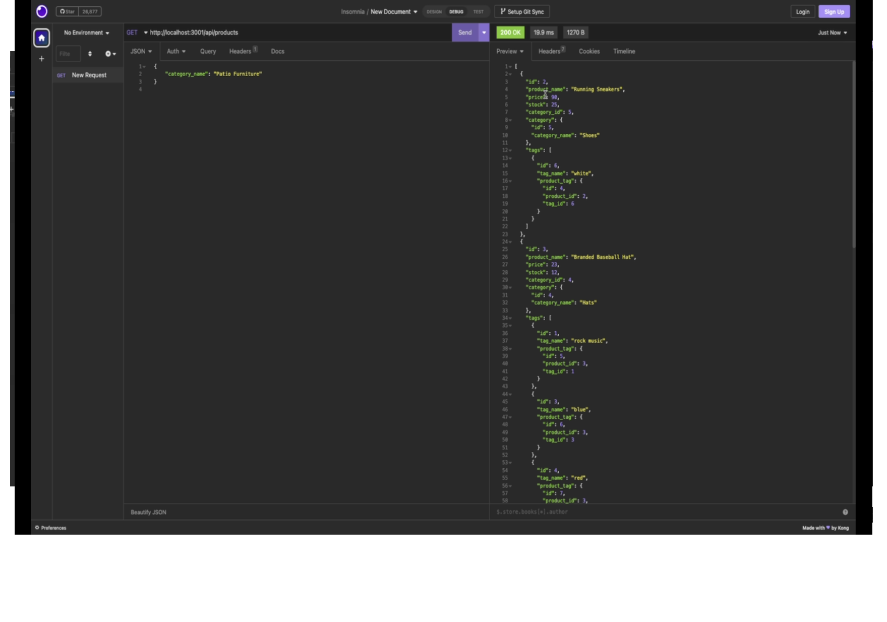

# e-commerce-backend


## Description

This application is the backed of an e-commerce website used to handle creating, reading, updating, and deleting items from the database.

## Table of Contents

1. [Installing Dependencies](#installing-dependencies)
2. [Usage](#usage)
3. [Contributing](#contributing)
4. [Testing](#testing)
5. [Reporting Errors](#reporting-errors)
6. [License](#license)
7. [Questions](#questions)

## Installing Dependencies

It uses the following technologies:

```
Express
MySql2
Dotenv
Sequelize
```

The command for installing dependencies is: 'npm install'

## Usage

This application can be invoked in the command line by starting the server using the command 'npm start'. The user may then make calls to routes for categories of items, products, and tags. For a full demonstration of the routes, please refer to the tutorial video.

[Tutorial Video](https://drive.google.com/file/d/13Ea7WTtq3GTUKeWc1EfAZHVxUknagyEh/view)



## Contributing

This repo is open for contributions.

## Testing

There are currently no tests for the application

## Reporting Errors

Please report all errors to andy.kleindienst@gmail.com

## License

MIT License

## Questions

For any questions regarding this project, please send correspondence to andy.kleindienst@gmail.com.

Please visit my profile on [GitHub](https://github.com/andykb9b13).
